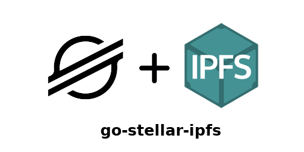

# go-stellar-ipfs


<center></center>

[](https://github.com/aanupam23/go-stellar-ipfs/releases) [](https://opensource.org/licenses/Apache-2.0) [](https://godoc.org/github.com/aanupam23/go-stellar-ipfs)


# Dependencies

- [Stellar Go SDK](https://github.com/stellar/go)
- [go-ipfs-api](https://github.com/ipfs/go-ipfs-api)

# Getting Started

go-stellar-ipfs is a library that acts as a bridge between Stellar and IPFS. It combines the low fee and fast speed stellar with ipfs. Using this library you can build stellar and IPFS application very quickly.

go-stellar-ipfs implements StellarShell that helps you use premade functions for sending any sort of data to IPFS using stellar transaction, memo, manage data and also allows reading of that data.

This library is divided in modular functions, which you can utilize in your application. 

Refer the below examples for sample usage.

# Example

A basic example which implements Addition of IPFS data in stellar compatible format.

```
package main

import (
        "fmt"
        "github.com/stellar/go/txnbuild"
        si "github.com/aanupam23/go-stellar-ipfs"
)

func main() {
        kp, _ := keypair.Parse(SECRETKEY)
        client := horizonclient.DefaultTestNetClient
        ar := horizonclient.AccountRequest{AccountID: kp.Address()}
        sourceAccount, err := client.AccountDetail(ar)
        check(err)

        ss := si.NewStellarShell("localhost:5001", "public")

        // Adding file to IPFS
        thash, err := ss.AddIpfsString("Meow")
        if err != nil {
                error := ss.IsListening()
                panic(error) // ends where
        }
        
        op := Payment{
            Destination: DESITINATION,
            Amount:      "10",
            Asset:       NativeAsset{},
        }

        tx := Transaction{
            SourceAccount: &sourceAccount,
            Operations:    []Operation{&op},
            Timebounds:    NewInfiniteTimeout(),
            Memo:          MemoHash(thash),
            Network:       network.TestNetworkPassphrase,
        }

        txe, err := tx.BuildSignEncode(kp.(*keypair.Full))
        if err != nil {
                panic(error)
        }
        fmt.Println(txe)
}
```
Replace SECRETKEY and DESITINATION with your inputs.

Another example, that reads the IPFS hash data after converting hash to multiaddr IPFS hash.

```
package main

import (
        "fmt"
        si "github.com/aanupam23/go-stellar-ipfs"
)

func main() {
        ss := si.NewStellarShell("localhost:5001", "public")

        thash, err: ss.ReadMemoHash(txnid)

        output, err := ss.IpfsDataString(thash)
        if err != nil {
                error := ss.IsListening()
                panic(error) // ends where
        }

        fmt.Println(output)
}
```

If you wish to get data in an io.Reader, than replace IpfsDataString with IpfsData function 
```
        output, err := ss.IpfsData(thash)
        if err != nil {
                error := ss.IsListening()
                panic(error)
        }

```
Check the godoc for complete list of functions.

# Running your code

Start IPFS daemon 

```
ipfs daemon
```

Once IPFS Daemon is initialized, run your code.
If ipfs is not installed on your system, refer this [guide](https://docs.ipfs.io/introduction/usage/) for installing IPFS.


# Upcoming/Missing Features

This library acts as a bridge between go-ipfs-api and stellar to make features easier to use.

|      | Features              | Status |
| ---- |:---------------------:| ------:|
| 1    | IPFS hash validation  |   x    |
| 2    | IPFS Add options      |   x    |
| 3    | IPFS bootstrap        |   x    |
| 4    | Suggest any feature   |   -    |

# Contribute
[go-stellar-ipfs](https://github.com/aanupam23/go-stellar-ipfs) is open source and all contributions are welcome.

Please refer [CONTRIBUTE.md](https://github.com/aanupam23/go-stellar-ipfs/CONTRIBUTE.md) for information.

# Licence

[](https://opensource.org/licenses/Apache-2.0)